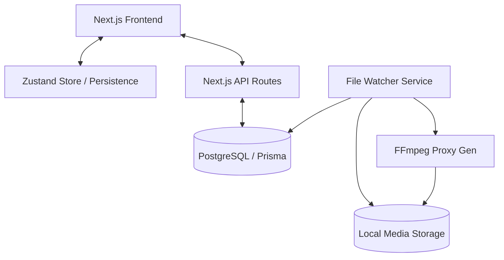

# News Forge: Architecture & Detailed Technical Design

This document dives deep into the architectural decisions and implementation details of the News Forge project.

## 1. System Architecture Diagram



## 2. Key Architectural Decisions

### 2.1 Unified Next.js Application
Instead of separating frontend and backend, we use Next.js for both. This simplifies deployment and sharing of TypeScript types between the UI and API. API routes handle DB interactions via Prisma.

### 2.2 Global State with Zustand
The application state (Stories, Clips, Rundowns) is managed globally using **Zustand**. 
- **Consistency**: All tabs reflect state changes immediately.
- **Persistence**: Critical session state is persisted to `localStorage` to survive refreshes.
- **Hydration**: State is hydrated from the database on initial session load.

### 2.3 File-Based Media Workflow
To handle large broadcast-quality media files without overloading the database:
- Raw files are stored on a high-speed local drive/NAS.
- Only metadata and file paths are stored in PostgreSQL.
- A **File Watcher** (planned) monitors folders to update clip statuses automatically.

## 3. Detailed Data Models

### 3.1 Stories
Stories are the central unit of work. They can be created in the `Input` tab and contain:
- `rawScript`: Initial text input.
- `polishedScript`: Refined text from Copy Editors.
- `format`: PKG, VO, ANCHOR, etc.
- `status`: DRAFT, READY, APPROVED.

### 3.2 Story Clips
Clips belong to a story and have a lifecycle:
- `PENDING`: Uploaded but no instructions.
- `AVAILABLE`: Ready for video editors.
- `EDITING` (or `IN_PROGRESS`): Claimed by an editor.
- `DONE` (or `COMPLETED`): Finished file saved to output directory.

## 4. Bilingual Implementation (Kannada & English)
The system uses `Noto Sans Kannada` as the primary font for Kannada scripts to ensure proper rendering of complex glyphs in news scripts.
- **Editor**: Text areas are configured with dynamic fonts and increased line-height for Kannada.
- **Metadata**: Story IDs include a language suffix (e.g., `-KN` or `-EN`) for easy identification in lists.

## 5. Background Services Strategy

### 5.1 File Watching (Node.js `chokidar`)
The backend is designed to run a watcher service that:
1. Detects new `.mxf` or `.mov` files in `/raw`.
2. Triggers an FFmpeg job.
3. Inserts a new `StoryClip` record into the DB if a Story ID is detected in the filename.

### 5.2 Proxy Generation (FFmpeg)
Command pattern for proxies:
```bash
ffmpeg -i {input_path} -vcodec libx264 -crf 28 -acodec aac -s 1280x720 {proxy_path}
```
This ensures editors can preview footage in the browser without downloading gigabytes of raw data.

---
*Documentation generated on 2026-04-15 by Antigravity AI.*
