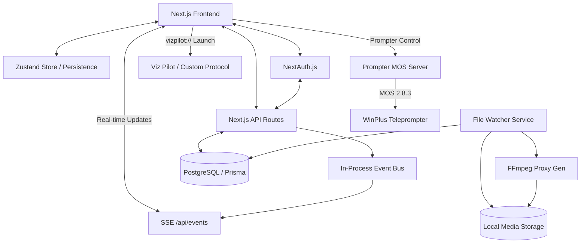

# News Forge: Architecture & Detailed Technical Design

This document dives deep into the architectural decisions and implementation details of the News Forge project.

## 1. System Architecture Diagram



## 2. Key Architectural Decisions

### 2.1 Unified Next.js Application
Instead of separating frontend and backend, we use Next.js for both. This simplifies deployment and sharing of TypeScript types between the UI and API. API routes handle DB interactions via Prisma.

### 2.2 Global State with Zustand
The application state (Stories, Clips, Rundowns) is managed globally using **Zustand**. 
- **Consistency**: All tabs reflect state changes immediately.
- **Persistence**: Critical session state is persisted to `localStorage` to survive refreshes.
- **Hydration**: State is hydrated from the database on initial session load, combined with real-time SSE.

### 2.3 User Authentication & NextAuth
Authentication is handled via **NextAuth.js** with a Custom Credentials Provider.
- Sessions are managed server-side and checked on route access via middleware.
- API endpoints are protected using server-side session checks via `getCurrentUserId()`.
- Supports role-based access control (PRODUCER, EDITOR, REPORTER, etc.).

### 2.4 Real-time Updates (SSE)
A lightweight Server-Sent Events (SSE) implementation is used for real-time collaboration.
- **Event Bus**: An in-process singleton event bus (`src/lib/event-bus.ts`) acts as the pub/sub core.
- **API Events Endpoint**: `/api/events` streams updates to connected clients.
- **Client Sync**: A custom `useSSE` hook listens for events and invalidates TanStack Query caches, seamlessly updating the UI across different browser sessions.

### 2.5 Viz Pilot Integration (Local Protocol)
Instead of relying on server-side launchers, Viz Pilot is integrated directly on the client's workstation:
- **Custom Protocol**: Windows workstations register a `vizpilot://` protocol using a provided `.reg` file.
- **Bat Execution**: The browser triggers the protocol, which executes a local `.bat` file on the machine, passing story context as parameters to launch Viz Pilot locally in Edge IE-mode.

### 2.6 Teleprompter MOS Bridge (TCP)
To support real-time script delivery to Teleprompter software (e.g., WinPlus):
- **TCP Server**: A dedicated `PrompterClient` runs a raw TCP server (default port 10541).
- **MOS Handshake**: Implements the MOS 2.8.3 handshake (`mosID`, `ncsID`, `heartbeat`).
- **Data Encoding**: Uses **Big Endian UTF-16** encoding and **Null-byte (`\0\0`) framing** to ensure compatibility with legacy prompter systems.
- **Rundown Delivery**: Sends the entire rundown as an `roCreate` XML message, and supports incremental `roStoryReplace` on edit.

### 2.7 CasparCG Playout Integration
Direct integration with CasparCG Server for broadcast playout:
- **TCP Command Pipeline**: Uses the AMCP protocol over TCP (port 5250) to control CasparCG.
- **Sub-route API**: Individual API routes for `play`, `stop`, `load`, and `media` status management.
- **Playlist Sync**: Synchronizes rundown entries with CasparCG layers for seamless transitions.

### 2.8 File-Based Media Workflow
To handle large broadcast-quality media files without overloading the database:
- Raw files are stored on a high-speed local drive/NAS.
- Only metadata and file paths are stored in PostgreSQL.
- **Proxy Generation**: A utility (`src/lib/proxy-generator.ts`) uses FFmpeg to generate 540p H.264 previews and thumbnails for web viewing.

## 3. Detailed Data Models

### 3.1 Stories
Stories are the central unit of work. They can be created in the `Input` tab and contain:
- `rawScript`: Initial text input.
- `polishedScript`: Refined text from Copy Editors.
- `format`: PKG, VO, ANCHOR, etc.
- `status`: DRAFT, READY, APPROVED.

### 3.2 Story Clips
Clips belong to a story and have a lifecycle:
- `PENDING`: Uploaded but no instructions.
- `AVAILABLE`: Ready for video editors.
- `EDITING`: Claimed by an editor.
- `COMPLETED`: Finished file saved to output directory.

## 4. Bilingual Implementation (Kannada & English)
The system uses `Noto Sans Kannada` as the primary font for Kannada scripts to ensure proper rendering of complex glyphs in news scripts.
- **Editor**: Text areas are configured with dynamic fonts and increased line-height for Kannada.
- **Metadata**: Story IDs include a language suffix (e.g., `-KN` or `-EN`) for easy identification in lists.

## 5. Background Services Strategy

### 5.1 File Watching (Node.js `chokidar`)
The backend is designed to run a watcher service that:
1. Detects new `.mxf` or `.mov` files in `/raw`.
2. Triggers an FFmpeg job.
3. Inserts a new `StoryClip` record into the DB if a Story ID is detected in the filename.

### 5.2 Proxy Generation (FFmpeg)
Command pattern for proxies:
```bash
ffmpeg -i {input_path} -vcodec libx264 -crf 28 -acodec aac -s 1280x720 {proxy_path}
```
This ensures editors can preview footage in the browser without downloading gigabytes of raw data.

---
*Documentation updated to reflect latest codebase (Phase 3.8 complete).*
