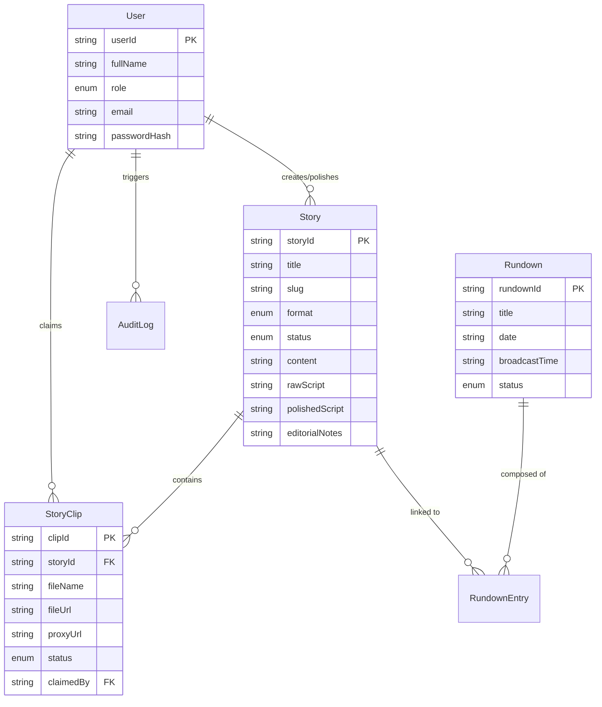

# News Forge: Technical Handover Documentation

This document provides a comprehensive overview of the **News Forge** project—a modern Broadcast Newsroom Computer System (NRCS) designed for high-speed local network environments with bilingual support.

## 1. Project Overview
**News Forge** is a specialized NRCS web application built for newsrooms. It streamlines the lifecycle of a news story from ingestion (Input) and editorial direction (Output) to production (Editor Hub) and final broadcast scheduling (Rundown).

### Key Objectives
- **Bilingual Support**: Native handling of Kannada and English scripts.
- **High Performance**: Optimized for local network environments with large media files.
- **Role-Based Workflow**: Distinct interfaces for Input, Output, Copy Editors, Video Editors, and Producers.
- **Automation**: Automated media proxy generation and story-clip linking.

---

## 2. Technology Stack

| Layer | Technology | Purpose |
| :--- | :--- | :--- |
| **Frontend** | [Next.js 16](https://nextjs.org/) (App Router) | React 19 Framework for UI and SEO |
| **Language** | [TypeScript](https://www.typescriptlang.org/) | Type-safe development |
| **Styling** | [Vanilla CSS](https://developer.mozilla.org/en-US/docs/Web/CSS) + [Tailwind CSS 4](https://tailwindcss.com/) | Modern, dense, dark-themed UI |
| **State Management** | [Zustand](https://github.com/pmndrs/zustand) | Global state for stories, clips, and rundowns |
| **Database** | [PostgreSQL](https://www.postgresql.org/) | Persistent relational data store |
| **ORM** | [Prisma](https://www.prisma.io/) | Database schema management and client |
| **Icons** | [Lucide React](https://lucide.dev/) | Consistent modern iconography |
| **Authentication** | [NextAuth.js](https://next-auth.js.org/) | Secure user sessions and role-based access |
| **Real-time** | SSE (Server-Sent Events) | Live updates across clients |

---

## 3. Project Structure

```text
/News-Forge
├── prisma/                  # Database schema (schema.prisma) and migrations
├── public/                  # Static assets (fonts, icons, protocol reg)
├── src/
│   ├── app/                 # Next.js App Router (Pages & API)
│   │   ├── (main)/          # Principal functional tabs
│   │   │   ├── input/       # Ingestion & Story Creation
│   │   │   ├── output/      # Editorial Notes & Instructions
│   │   │   ├── editor-hub/  # Copy & Video Editing
│   │   │   ├── rundown/     # Broadcast Schedule & Playout
│   │   │   ├── settings/    # System Configuration
│   │   │   └── workspace/   # User Profile & Preferences
│   │   ├── api/             # Backend API Implementation
│   │   └── login/           # Auth landing page
│   ├── components/          # Reusable UI components
│   ├── hooks/               # Custom React hooks (useAuth, useSSE, etc.)
│   ├── store/               # Zustand global state
│   ├── lib/                 # Shared logic (prisma, auth, event-bus, clients)
│   ├── types/               # TypeScript definitions
│   └── utils/               # Helper functions
├── AGENTS.md                # AI Agent roadmap and specs
├── ARCHITECTURE.md          # Technical deep dive
└── README.md                # Setup and installation
```

---

## 4. Domain Model (Database Entity Relationships)



---

## 5. Core Workflows

### 5.1 The Editorial Pipeline
1.  **Input**: Team creates a story and uploads raw clips/text. A **Story ID** is auto-generated (e.g., `STY-20260423-421`).
2.  **Output**: Team adds editorial notes and clip instructions. They transition clips from `PENDING` to `AVAILABLE`.
3.  **Editor Hub**: 
    - **Copy Editors**: Write and refine scripts in the bilingual editor.
    - **Video Editors**: Claim `AVAILABLE` clips, edit them in external tools, and save to the output directory.
4.  **Linking**: The system auto-detects finished files and links them back to stories using Story ID metadata.
5.  **Rundown**: Producers organize stories into a timeline, manage timing, and trigger playout/teleprompter feeds.

---

## 6. Implementation Status

| Feature | Status | Notes |
| :--- | :--- | :--- |
| **Top Navigation** | ✅ Completed | Fixed nav with workspace, input, output, hub, rundown, settings. |
| **Dark Theme** | ✅ Completed | Professional charcoal theme implemented. |
| **User Auth** | ✅ Completed | NextAuth implemented with custom credentials and middleware. |
| **Real-time (SSE)** | ✅ Completed | In-process event bus and `/api/events` for live updates. |
| **Viz Pilot** | ✅ Completed | Custom `vizpilot://` protocol launching local `.bat` file. |
| **Prompter MOS** | ✅ Completed | TCP server (Port 10541) with Big Endian UTF-16 framing. |
| **CasparCG** | ✅ Completed | API routes and AMCP client for full playout control. |
| **Rundown Editor** | ✅ Polished | Fully integrated with story ordering, timing, and MOS. |
| **Editor Hub** | ✅ Polished | Dual-mode (Video/Copy) UI state working. |
| **Input Page** | ✅ Polished | Story creation active; local media ingestion and metadata extraction working. |
| **File Watcher** | 🟡 In Progress | Automated folder monitoring and background proxy generation logic in development. |

---

## 7. Setup & Development

### Local Environment
1.  **Clone & Install**: `npm install`
2.  **Database Setup**:
    - Ensure PostgreSQL is running.
    - `npx prisma db push`
    - `npm run prisma:seed`
3.  **Run Development**: `npm run dev`

### Key Environment Variables
- `DATABASE_URL`: Connection string for PostgreSQL.
- `NEXTAUTH_SECRET`: Secret for NextAuth session encryption.
- `NEXTAUTH_URL`: Base URL (e.g., `http://192.168.1.126:3000`).
- `CASPAR_HOST` / `CASPAR_PORT`: CasparCG server details.
- `PROMPTER_PORT`: Port for MOS bridge (default 10541).

---

## 8. Development Guidelines
- **State Persistence**: Critical entities use Zustand with persistence.
- **Real-time First**: When adding mutations, always use `emitStoryEvent`, `emitClipEvent`, etc.
- **Encoding Alert**: MOS communication MUST use Big Endian UTF-16 with null-byte terminators.
- **Bilingual First**: Always test scripts with Kannada glyphs to ensure rendering integrity.

---
*Documentation updated to reflect latest codebase (2026-04-24).*
