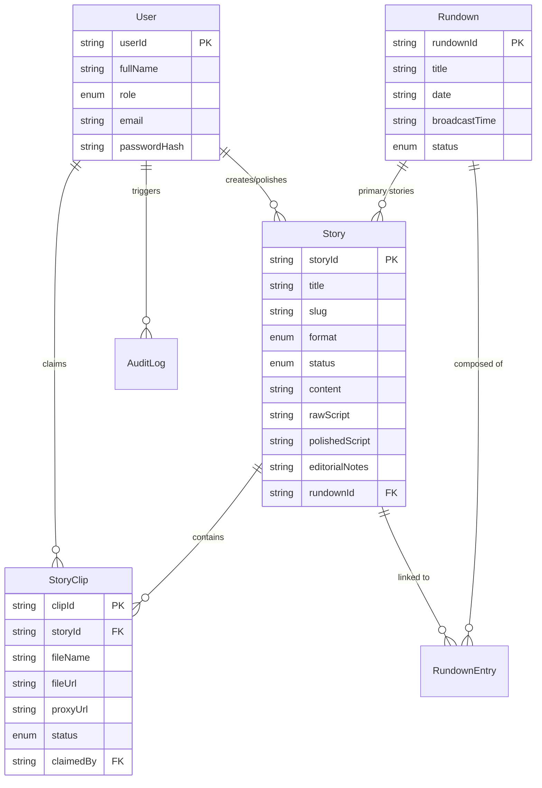

# News Forge: Technical Handover Documentation

This document provides a comprehensive overview of the **News Forge** project—a modern Broadcast Newsroom Computer System (NRCS) designed for high-speed local network environments with bilingual support.

## 1. Project Overview
**News Forge** is a specialized NRCS web application built for newsrooms. It streamlines the lifecycle of a news story from ingestion (Input) and editorial direction (Output) to production (Editor Hub) and final broadcast scheduling (Rundown).

### Key Objectives
- **Bilingual Support**: Native handling of Kannada and English scripts.
- **High Performance**: Optimized for local network environments with large media files.
- **Role-Based Workflow**: Distinct interfaces for Input, Output, Copy Editors, Video Editors, and Producers.
- **Automation**: Automated media proxy generation and story-clip linking.

---

## 2. Technology Stack

| Layer | Technology | Purpose |
| :--- | :--- | :--- |
| **Frontend** | [Next.js 14](https://nextjs.org/) (App Router) | React Framework for UI and SEO |
| **Language** | [TypeScript](https://www.typescriptlang.org/) | Type-safe development |
| **Styling** | [Vanilla CSS](https://developer.mozilla.org/en-US/docs/Web/CSS) + [Tailwind CSS 4](https://tailwindcss.com/) | Modern, dense, dark-themed UI |
| **State Management** | [Zustand](https://github.com/pmndrs/zustand) | Global state for stories, clips, and rundowns |
| **Database** | [PostgreSQL](https://www.postgresql.org/) | Persistent relational data store |
| **ORM** | [Prisma](https://www.prisma.io/) | Database schema management and client |
| **Icons** | [Lucide React](https://lucide.dev/) | Consistent modern iconography |
| **Fonts** | Inter, JetBrains Mono, Noto Sans Kannada | Readability and script support |

---

## 3. Project Structure

```text
/News-Forge
├── prisma/                  # Database schema (schema.prisma) and migrations
├── public/                  # Static assets (fonts, icons)
├── src/
│   ├── app/                 # Next.js App Router (Pages & API)
│   │   ├── (main)/          # Principal functional tabs
│   │   │   ├── input/       # Ingestion & Story Creation
│   │   │   ├── output/      # Editorial Notes & Instructions
│   │   │   ├── editor-hub/  # Copy & Video Editing
│   │   │   ├── rundown/     # Broadcast Schedule & Playout
│   │   │   ├── settings/    # System Configuration
│   │   │   └── workspace/   # User Profile & Preferences
│   │   └── api/             # Backend API Implementation
│   ├── components/          # Reusable UI components
│   ├── store/               # Zustand global state (useNewsForgeStore.ts)
│   ├── lib/                 # Shared logic (prisma client, utils)
│   ├── types/               # TypeScript definitions
│   └── utils/               # Helper functions
├── AGENTS.md                # Comprehensive requirements and spec document
├── CLAUDE.md                # Development guidelines and commands
└── package.json             # Dependencies and scripts
```

---

## 4. Domain Model (Database Entity Relationships)



---

## 5. Core Workflows

### 5.1 The Editorial Pipeline
1.  **Input**: Team creates a story and uploads raw clips/text. A **Story ID** is auto-generated (e.g., `STY-2025-0042-KN`).
2.  **Output**: Team adds editorial notes and clip instructions. They transition clips from `PENDING` to `AVAILABLE`.
3.  **Editor Hub**: 
    - **Copy Editors**: Write and refine scripts in the bilingual editor.
    - **Video Editors**: Claim `AVAILABLE` clips, edit them in external tools (Premiere/DaVinci), and save to the `/edited/` directory.
4.  **Linking**: The system auto-detects finished files and links them back to stories using Story ID metadata.
5.  **Rundown**: Producers organize stories into a timeline, manage timing, and trigger playout/teleprompter feeds.

### 5.2 Story ID & Media Management
- **Format**: `STY-[YYYY]-[Sequential Number]-[Language]`
- **Sidecar JSON**: A `manifest.json` accompanies media folders to maintain metadata without relying on fragile video headers.
- **Proxy Work**: A background service (FFmpeg) auto-generates 720p H.264 previews for every uploaded raw clip.

---

## 6. Implementation Status

| Feature | Status | Notes |
| :--- | :--- | :--- |
| **Top Navigation** | ✅ Completed | Fixed nav with workspace, input, output, hub, rundown, settings. |
| **Dark Theme** | ✅ Completed | Professional charcoal theme implemented. |
| **Zustand Store** | ✅ Completed | Integrated with persistence and seed data. |
| **User Auth** | ✅ Completed | NextAuth implemented with custom credentials and middleware. |
| **Real-time (SSE)** | ✅ Completed | In-process event bus and `/api/events` for live updates. |
| **Viz Pilot** | ✅ Completed | Custom `vizpilot://` protocol launching local `.bat` file. |
| **Input Page** | 🟡 In Progress | Story creation active; local media ingestion needs final hookup. |
| **Editor Hub** | 🟢 Polished | Dual-mode (Video/Copy) UI state working. |
| **Rundown** | 🟡 In Progress | Table view active; reordering and timing logic pending. |
| **Settings** | 🟡 Basic | UI layout ready; actual state persistence per section in progress. |
| **MOS/CAS** | ⚪ Planned | Status indicators in nav are placeholders. |

---

## 7. Setup & Development

### Local Environment
1.  **Clone & Install**:
    ```bash
    npm install
    ```
2.  **Database Setup**:
    - Ensure PostgreSQL is running.
    - Update `.env` with `DATABASE_URL`.
    - Push schema: `npx prisma db push`
    - Seed data: `npm run prisma:seed`
3.  **Run Development**:
    ```bash
    npm run dev
    ```

### Key Environment Variables
- `DATABASE_URL`: Connection string for PostgreSQL.
- `NEXTAUTH_SECRET`: Secret for NextAuth session encryption.
- `NEXTAUTH_URL`: Base URL of the application.
- `STORAGE_BASE_PATH`: Local directory for raw/edited media storage.
- `FFMPEG_PATH`: Path to FFmpeg binary for proxy generation.

---

## 8. Development Guidelines (Heads-up for Tech Team)
- **State over Prop Drilling**: Always use the Zustand `useNewsForgeStore` for global entities (Stories/Clips).
- **Responsive Density**: Keep UI elements compact. Newsroom users prefer seeing more data over more whitespace.
- **Bilingual First**: Always test script editor with both Kannada and English characters to ensure proper line-height and font rendering.
- **File Watcher Safety**: When implementing the file watcher, handle file locking gracefully as editors may still be writing to the output directory.

---
*Documentation updated to reflect latest codebase.*
